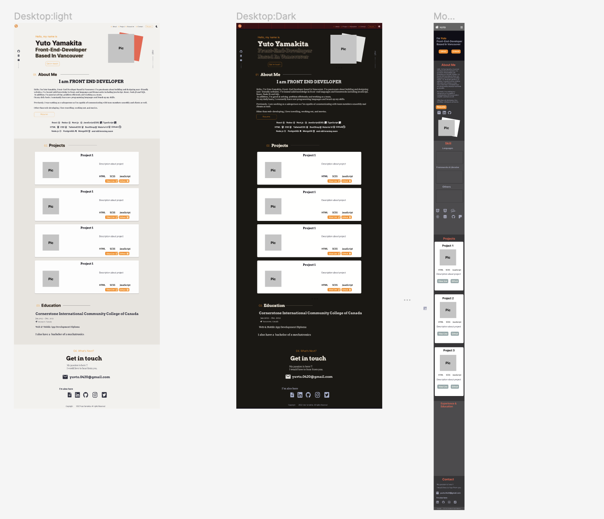

# Yuto Yamakita Portfolio Website

[Link to demo](https://my-portfolio-two-self-48.vercel.app/)

## About

This is my personal portfolio website which shows you what I am capable of, my projects and so on.

## Language and Libraries

- Next.js
- TypeScript
- Tailwind.css
- Framer Motion
- Sanity.io

Next.js is one of a modern JavaScript frameworks. It holds React on its base.
Its key features is the ability to automatically cade split your application, meaning that each page only load the necessary JavaScript for that page view.

In order to make the most of Next.js features, I use Sanity.io to store data such as project, skills etc.
So, it is safe to say this website is Jamstack(JavaScript/API/Markup).

I also use Framer Motion to add the animations.

## UI Design

I created mockup design using Figma.
During working on the design, I cared user experience as well because this portfolio represent me.
